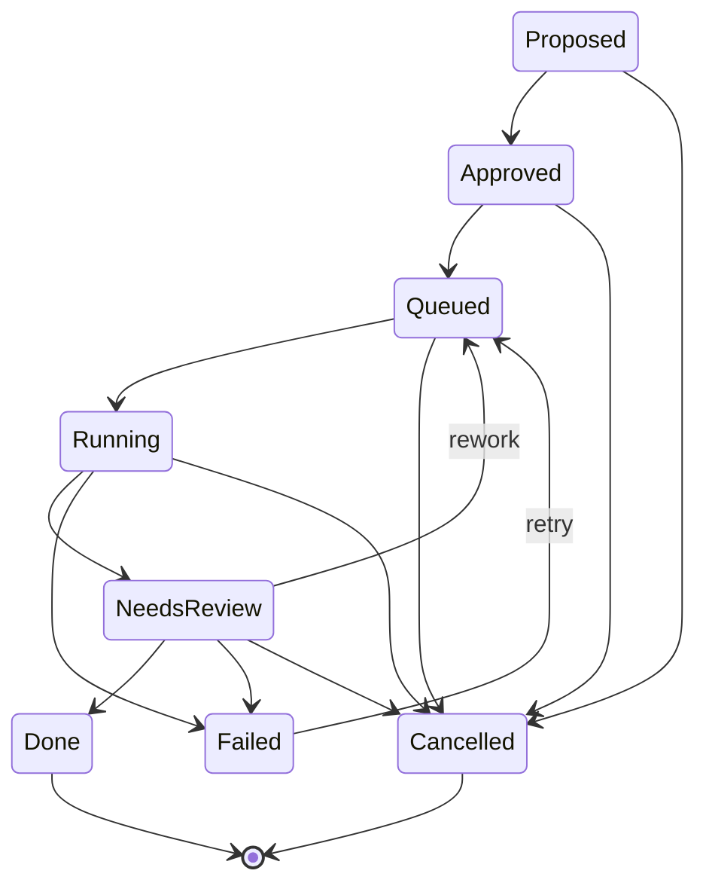

# 02 — Domain model

All entities live in `mobius-core::model`, identified by typed uuid newtypes
(`OrganizationId`, `RepositoryId`, `ProjectId`, `AgentId`, `ModelProfileId`,
`HarnessId`, `TaskId`, `RunId`, `SignalId`, `MemoryEntryId`,
`ConversationId`, `MessageId`, `PermissionRequestId`, `ResearchId`).

## Configuration entities (DB-backed, CRUD via REST)

| Entity | Key fields |
|---|---|
| `Organization` | name, slug |
| `Repository` | owner, name, provider, default_branch, local_path |
| `Project` | `organization_id`, slug, `repository_ids` (routing hint), scope `{paths, labels, keywords}`, status |
| `Agent` | role (`Organization \| Project \| Reviewer \| Housekeeping`), `organization_id`, `project_id?`, profiles (`ActivityProfiles`), instructions, permission_policy |
| `ModelProfile` | name, harness_id, model?, effort?, config overrides |
| `Harness` | name, command, args, env, default_permission_policy, model_arg_template |

`Agent.profiles` maps `Activity` → `ModelProfileId` (default + per-activity
overrides). The harness for any piece of work is derived through the resolved
profile — agents never reference harnesses directly.

**Projects are feature/domain-level and owned by the organization**, not by a
repository. `Project.repository_ids` is only a routing hint: signal routing
matches `repository_ids.contains`, and tasks require exactly one repository to
run. There is no "primary repository".

**Coordinators** are `Organization`- and `Project`-role agents. They run in
`<data_dir>/memory/<org-slug>/` with `PermissionPolicy::ReadOnly`, never see
repository local paths, research code facts via `mobius research start`, and
(project coordinators) create tasks for physical changes — see ADR-0010.

## Work entities

- `Signal` — one inbound event; `dedupe_key` makes ingestion idempotent.
- `Task` — a physical change owned by a project, executed against exactly one
  repository in a fresh git worktree (`mobius/task-<id8>` branch).
  `TaskKind = Feature | Fix | Spec | Refactor | Review | Housekeeping |
  Triage` (`Triage` is reserved for signal routing). `parent_task_id` gives a
  hierarchy; `origin` links back to the signal or conversation.
- `Run` — one execution attempt: resolved `model_profile_id` + `harness_id`,
  `repository_id`, `conversation_id` (the run *is* a `Run`-kind
  conversation), worktree path, branch, ACP session id, status, summary.
- `Research` — a read-only code investigation: question, repository ids,
  findings (`## Findings` section to end of reply), status
  (`Pending | Running | Done | Failed | Cancelled`), linked `conversation_id`.
  Research is its own entity, not a `TaskKind`.
- `MemoryEntry` — scoped note (`Fact | Decision | Convention | Gotcha |
  Summary`) with `source_conversation_id` / `source_run_id` provenance;
  supersession via `superseded_by`.

## Chat entities

- `Conversation` — `kind: Chat | Run | Research`. Chats are coordinator
  conversations scoped to a project (or the organization); runs and research
  open a conversation for their transcript. `organization_id` is always set;
  `project_id` is optional. `memory_scope()` = project scope when attached to
  a project, else the organization.
- `Message` — author (`human | agent | system`) + ordered `ContentBlock`s
  (`text | thought | tool_call | plan`).
- `PermissionRequest` — a parked ACP permission prompt for a conversation or
  a run; `Pending | Resolved{option_id} | Expired`.

## Task state machine

`TaskStatus::can_transition_to` encodes exactly these edges (unit-tested).

## Conversation status

`Idle → Streaming → AwaitingPermission → Streaming → Idle`, and `Closed` for
ended sessions.

## Run status

`Pending → Starting → Running → AwaitingPermission → Running →
Succeeded | Failed | Cancelled`.
