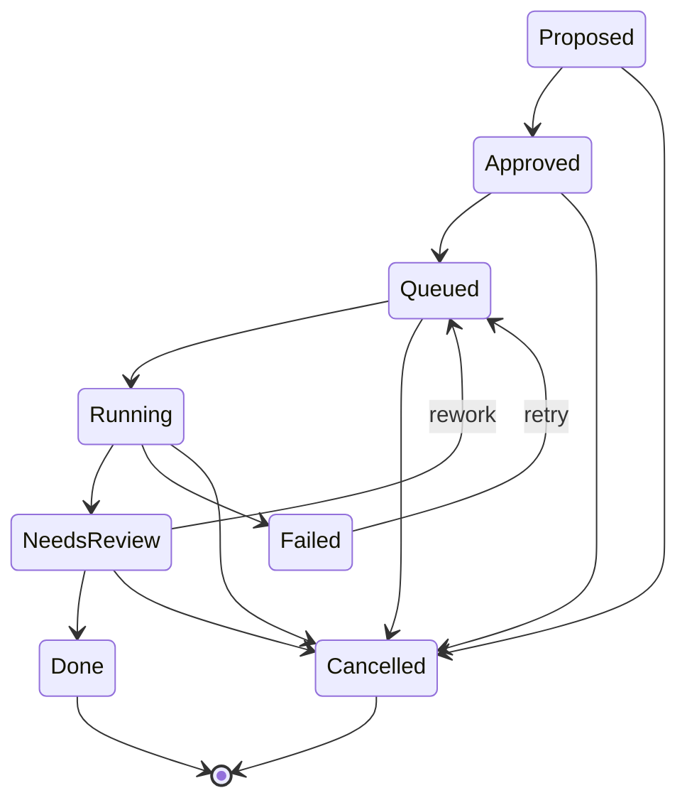

# 02 — Domain model

All entities live in `mobius-core::model`, identified by typed uuid newtypes
(`OrganizationId`, `RepositoryId`, `ProjectId`, `AgentId`, `ModelProfileId`,
`HarnessId`, `TaskId`, `RunId`, `SignalId`, `MemoryEntryId`,
`ConversationId`, `MessageId`, `PermissionRequestId`).

## Configuration entities (DB-backed, CRUD via REST)

| Entity | Key fields |
|---|---|
| `Organization` | name, slug |
| `Repository` | owner, name, provider, default_branch, local_path |
| `Project` | slug, scope `{paths, labels, keywords}`, status |
| `Agent` | role, profiles (`ActivityProfiles`), instructions, permission_policy |
| `ModelProfile` | name, harness_id, model?, effort?, config overrides |
| `Harness` | name, command, args, env, default_permission_policy, model_arg_template |

`Agent.profiles` maps `Activity` → `ModelProfileId` (default + per-activity
overrides). The harness for any piece of work is derived through the resolved
profile — agents never reference harnesses directly.

## Work entities

- `Signal` — one inbound event; `dedupe_key` makes ingestion idempotent.
- `Task` — unit of work owned by an agent; `origin` links back to the signal
  or GitHub number.
- `Run` — one execution attempt: activity, resolved `model_profile_id` +
  `harness_id`, worktree path, branch, ACP session id, status, summary.
- `MemoryEntry` — scoped note (`Fact | Decision | Convention | Gotcha |
  Summary`); supersession via `superseded_by`.

## Chat entities

- `Conversation` — a long-lived chat session with an agent: activity `Chat`,
  resolved profile, workdir, `acp_session_id`, status, advertised
  `config_options`.
- `Message` — author (`human | agent | system`) + ordered `ContentBlock`s
  (`text | thought | tool_call | plan`).
- `PermissionRequest` — a parked ACP permission prompt for a conversation or
  a run; `Pending | Resolved{option_id} | Expired`.

## Task state machine

`TaskStatus::can_transition_to` encodes exactly these edges (unit-tested).

## Conversation status

`Idle → Streaming → AwaitingPermission → Streaming → Idle`, and `Closed` for
ended sessions.

## Run status

`Pending → Starting → Running → AwaitingPermission → Running →
Succeeded | Failed | Cancelled`.
