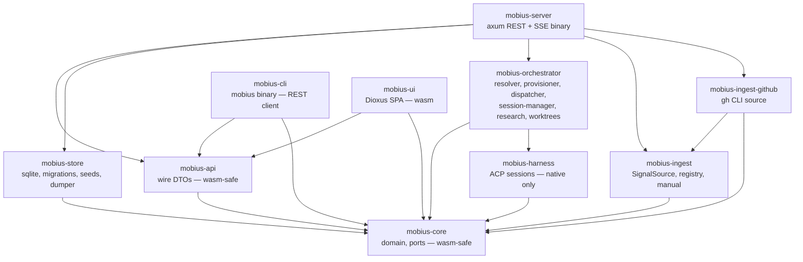
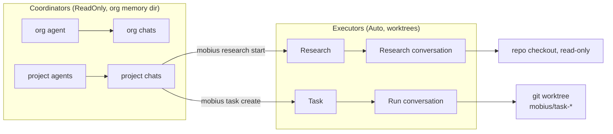
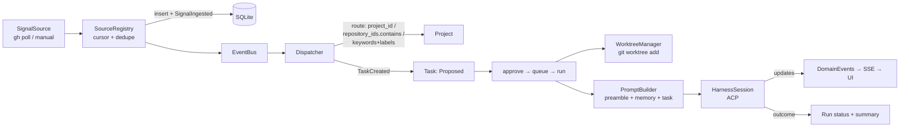

# 03 — System architecture

Single self-hosted binary (`mobius-server`) + `mobius` CLI + Dioxus SPA.
SQLite is the source of truth for all state; markdown memory dumps are
derived artifacts.

## Crate dependency graph

`mobius-core` defines async **port traits** (`ports` module) so orchestration
never depends on sqlx. `mobius-store` and the in-memory store implement them;
`Arc<T>` delegates so shared stores satisfy the same bounds.

## Roles and where code runs

Coordinators never touch repository working copies (ADR-0010). They act
through the `mobius` CLI (ADR-0009): harness processes get `MOBIUS_URL` plus
`MOBIUS_ORG`/`MOBIUS_PROJECT`/`MOBIUS_CONVERSATION`/`MOBIUS_TASK`/`MOBIUS_RUN`/
`MOBIUS_RESEARCH` in `extra_env`, and the directory containing the `mobius`
binary (`[cli] bin_dir`, default: `current_exe()`'s directory) is prepended to
`PATH`.

## Signal → work flow

- `Dispatcher::create_task` validates project/repository/parent and creates
  `Proposed` tasks (rejects `Triage`).
- `Dispatcher::start_task` legal-transitions to `Running`, creates a worktree
  (failure → task `Failed`, never falls back to the user's checkout), opens a
  `Run` conversation (`PermissionPolicy::Auto`), and drives it with
  `SessionManager::run_turn` in the background.
- `ResearchService::start` validates repos + local checkouts, defaults an
  empty repository list to project hints or all org repos with `local_path`,
  opens a read-only `Research` conversation (single repo → its checkout, else
  org memory dir), and records findings.

## Request surfaces

- `GET/POST/PUT/DELETE /api/v1/{organizations,repositories,projects,agents,
  model_profiles,harnesses}` — domain config CRUD, 422 on invalid refs.
- `GET/POST /api/v1/tasks`, `GET/PUT /api/v1/tasks/{id}`,
  `POST /api/v1/tasks/{id}/{run,cancel}`, `GET /api/v1/tasks/{id}` →
  `TaskView` (task + runs + children), `GET /api/v1/runs`.
- `GET/POST /api/v1/research`, `GET /api/v1/research/{id}`,
  `POST /api/v1/research/{id}/cancel`.
- `GET/POST /api/v1/memory`, `DELETE /api/v1/memory/{id}`; scope filter
  `organization:<id> | repository:<id> | project:<id>`.
- `GET/POST /api/v1/conversations` (+ `project_id`/`kind` filters),
  `/conversations/{id}/messages|config|cancel`, `/permissions/{id}`.
- `GET /api/v1/signals`, `POST /api/v1/signals/manual`.
- `GET /api/v1/events` — SSE of `EventEnvelope` (`id:` + `Last-Event-ID`
  replay from a 1024-entry ring buffer; `?conversation_id=` filter).

## Process model

- One tokio runtime; axum server.
- Manual source polls at 500 ms; GitHub sources at `[github]
  poll_interval_secs`.
- Each live conversation (chat/run/research) owns a `HarnessSession` — one
  spawned CLI subprocess, one ACP connection, one ACP session.
- `MemoryDumper` runs on startup, debounced 2 s after memory-relevant events,
  and every 5 min.
- Shutdown (`SIGINT`) closes all sessions.
