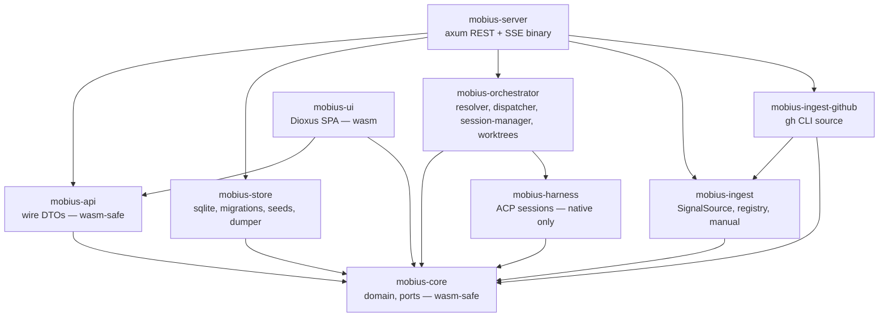
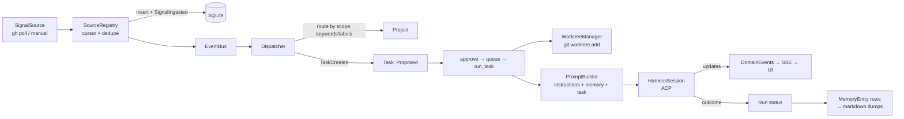

# 03 — System architecture

Single self-hosted binary (`mobius-server`) + Dioxus SPA. SQLite is the source
of truth for all state; markdown memory dumps are derived artifacts.

## Crate dependency graph

`mobius-core` defines async **port traits** (`ports` module) so orchestration
never depends on sqlx. `mobius-store` and the in-memory store implement them;
`Arc<T>` delegates so shared stores satisfy the same bounds.

## Signal → work flow

## Request surfaces

- `GET/POST/PUT/DELETE /api/v1/{organizations,repositories,projects,agents,
  model_profiles,harnesses}` — domain config CRUD, 422 on invalid refs.
- `GET /api/v1/{tasks,runs,signals,memory,permissions}` — read-only.
- `POST /api/v1/signals/manual` — human input into ingestion.
- `GET /api/v1/events` — SSE of `EventEnvelope` (`id:` + `Last-Event-ID`
  replay from a 1024-entry ring buffer; `?conversation_id=` filter).
- Chat routes under `/api/v1/conversations/…` and `/api/v1/permissions/…`.

## Process model

- One tokio runtime; axum server.
- Manual source polls at 500 ms; GitHub sources at `[github]
  poll_interval_secs`.
- Each live conversation/run owns a `HarnessSession` (one spawned CLI
  subprocess, one ACP connection, one ACP session).
- Shutdown (`SIGINT`) closes all sessions.
