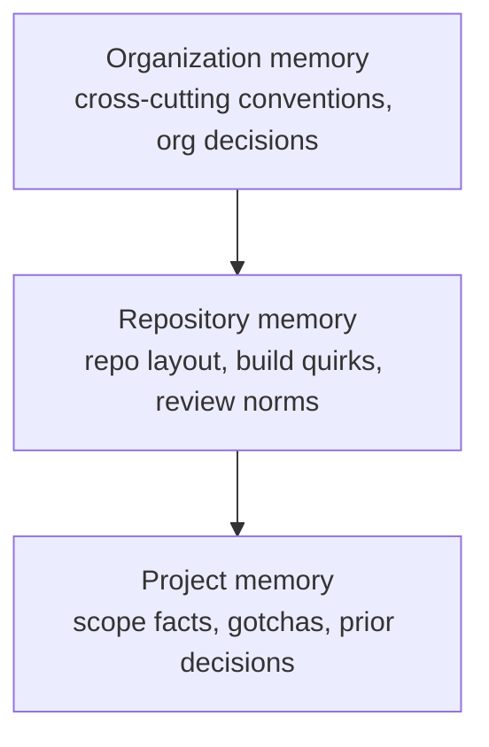

# 04 — Memory

## Three scopes



`MemoryScope = Organization(id) | Repository(id) | Project(id)` — a tagged
object in JSON (`{"level":"project","id":"…"}`). A `MemoryEntry` has a `kind`
(`Fact | Decision | Convention | Gotcha | Summary`), free-text `content`,
provenance (`source_conversation_id`, `source_run_id`), and `superseded_by`
for corrections without history loss.

## SQL is the source of truth

Entries are rows in SQLite — queryable, scoped, superseded-aware. Markdown is
a **derived dump**, not a store. `MemoryDumper::dump(store, data_dir)` writes
one directory per organization (`<data_dir>/memory/<org-slug>/`):

```
organization.md            # organization scope
projects.md                # project catalogue (slug, name, hints, scope)
repos/<owner>--<name>.md   # repository scope
projects/<slug>.md         # project scope
```

grouped by kind, skipping superseded entries. The server dumps on startup,
debounced (2 s) after memory-relevant domain events, and every 5 min.

## Explicit writes only

There is no automatic extraction, no summarizer harness, no memory-extract
profile, and no `Activity::Memory`. Agents write memory deliberately through
the `mobius` CLI (`mobius memory add --kind … "…" [--scope …]`) or humans via
the UI / `POST /api/v1/memory`. The CLI injects `source_conversation_id` from
`MOBIUS_CONVERSATION`, so provenance comes free inside conversations.

## How agents consume it

`PromptBuilder` renders the scoped memory into the preamble as grouped
sections (`## Organization`, `## Repository owner/name`, `## Project slug`) —
chat preambles for coordinators, research prompts for investigators, run
prompts for implementers — capped at 24k chars, dropping the globally oldest
entries first. Superseded entries never render.

## Coordinator working directory

Coordinators (organization and project agents) run in the organization memory
directory itself — `<data_dir>/memory/<org-slug>/` — under
`PermissionPolicy::ReadOnly`. The dump files are their visible filesystem;
the repo checkouts are not (ADR-0010).

## Future: `.mobius/memory/` mirroring

Dumps could be mirrored into the repository itself (`.mobius/memory/`) so
harnesses discover memory organically in-tree and humans can review changes
through PRs. The SQL store stays authoritative either way.
