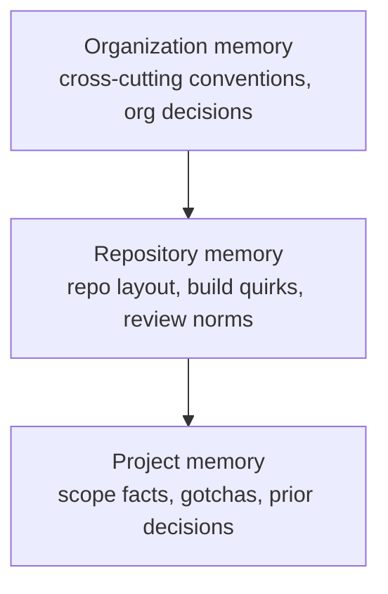

# 04 — Memory

## Three scopes



`MemoryScope = Organization | Repository | Project`. A `MemoryEntry` has a
`kind` (`Fact | Decision | Convention | Gotcha | Summary`), free-text
`content`, an optional `source_run_id`, and `superseded_by` for corrections
without history loss.

## SQL is the source of truth

Entries are rows in SQLite — queryable, scoped, superseded-aware. Markdown is
a **derived dump**, not a store. `MemoryDumper::dump(store, data_dir)` writes:

```
<data_dir>/memory/<org-slug>.md            # organization scope
<data_dir>/memory/<repo>/repo.md           # repository scope
<data_dir>/memory/<repo>/<project>.md      # project scope
```

grouped by kind, skipping superseded entries. The server dumps periodically
(every 5 min in M0).

## How agents consume it

`PromptBuilder` inlines the project + repository memory into run prompts so
the harness reads knowledge as text. Because markdown is a plain file, harness
agents can also grep it inside their worktree.

## Future: `.mobius/memory/` mirroring

Dumps could be mirrored into the repository itself (`.mobius/memory/`) so
harnesses discover memory organically in-tree and humans can review changes
through PRs. The SQL store stays authoritative either way.

## M3: memory extraction

Runs will write memory entries summarizing what they learned; supersession
lets corrections replace stale facts without losing provenance.
